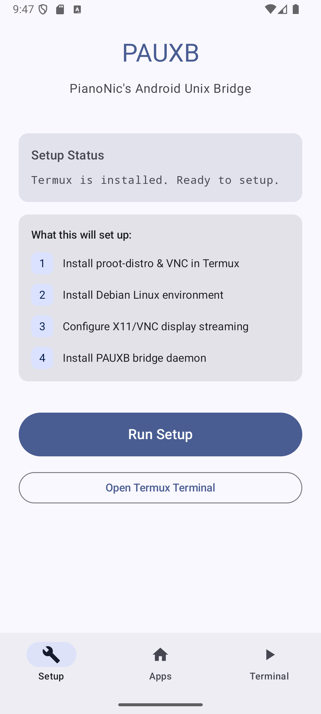
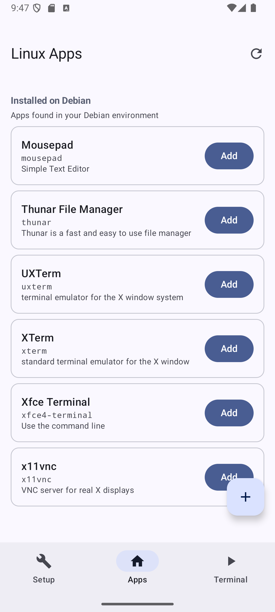
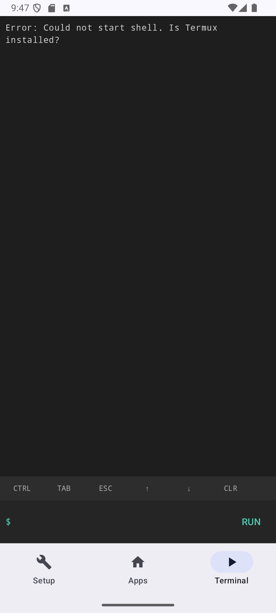
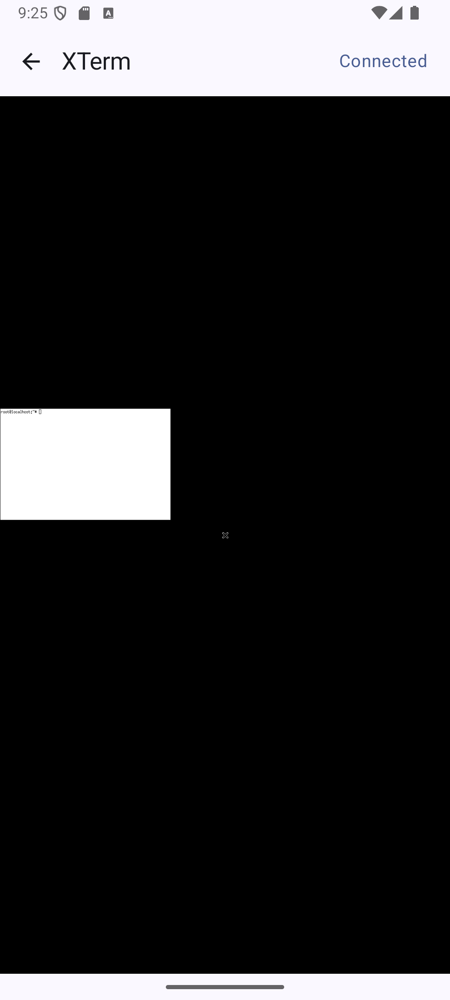

# PAUXB

**(Spelled: Paux B)** PianoNic's Android Unix Bridge

Run Linux desktop applications natively on Android — especially on Samsung DeX — by streaming them via VNC from a lightweight Debian environment inside Termux.

## How It Works

PAUXB sets up a **Debian Linux environment** inside [Termux](https://github.com/termux/termux-app) using `proot-distro`. Each Linux app runs in its own virtual X11 display (`Xvfb`) with a VNC server (`x11vnc`). The Android app connects to the VNC stream and renders it responsively, with full touch/mouse input support.

```
Android App  <-->  VNC Client  <-->  x11vnc  <-->  Xvfb  <-->  Linux App
                                         (inside Debian/proot)
```

## Screenshots

<p align="center">
  
  
  
  
</p>

| Setup | Apps | Terminal | VNC Stream |
|:---:|:---:|:---:|:---:|
| One-tap Debian setup | Discover installed Linux apps | Built-in shell access | Stream Linux apps fullscreen |

## Features

- **Automatic setup** — Installs Termux dependencies, Debian via proot-distro, X11/VNC packages, and the bridge daemon
- **App discovery** — Scans Debian for installed GUI applications from `.desktop` files
- **VNC streaming** — Native RFB 3.8 protocol client with raw and CopyRect encoding
- **Touch input** — Full pointer and keyboard event forwarding to Linux apps
- **Home screen shortcuts** — Pin Linux apps to the Android home screen for quick access
- **Fullscreen mode** — Double-tap to toggle, keeps screen on while streaming
- **Samsung DeX support** — Responsive window resizing for desktop mode
- **Bridge daemon** — Manages per-app virtual displays with start/stop/resize controls

## Requirements

- Android 8.0+ (API 26)
- [Termux](https://github.com/termux/termux-app/releases) (GitHub version, **not** Play Store)
- ~500MB free storage for the Debian environment

## Installation

1. Install [Termux from GitHub](https://github.com/termux/termux-app/releases)
2. Install the PAUXB APK from [Releases](https://github.com/PianoNic/PAUXB/releases)
3. Open PAUXB and tap **Run Setup**
4. Wait for the setup to complete (installs Debian + packages)
5. Go to the **Apps** tab and tap the refresh button to discover installed apps

## Installing Linux Apps

From the **Terminal** tab or Termux:

```bash
proot-distro login debian
apt install firefox-esr  # or any GUI app
```

Then tap refresh on the **Apps** tab to discover the new app.

## Architecture

```
src/
├── app/src/main/
│   ├── assets/scripts/       # Shell scripts for setup and bridge daemon
│   ├── java/ch/pianonic/pauxb/
│   │   ├── bridge/           # Termux communication layer
│   │   ├── terminal/         # Built-in terminal session
│   │   ├── vnc/              # VNC client and Compose viewer
│   │   └── ui/screens/       # Jetpack Compose UI screens
│   └── AndroidManifest.xml
└── .github/
    ├── workflows/            # CI/CD: build, release, version bump
    ├── release-drafter.yml   # Automatic release notes
    └── FUNDING.yml
```

## Building

```bash
cd src
./gradlew assembleDebug
# APK at app/build/outputs/apk/debug/app-debug.apk
```

## Contributing

1. Fork the repository
2. Create a feature branch (`feature/123_MyFeature` or `bug/123_FixSomething`)
3. Commit with conventional commits (`feat:`, `fix:`, `refactor:`)
4. Open a Pull Request

## License

MIT
